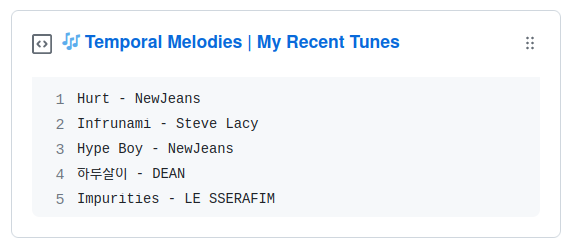

    </img>

<h3 align="center">Temporal Melodies</h3>

  
  
  
  

---

🎼 Integrate Spotify with Github to showcase your recent tunes.

## Table of Contents
- [About The Project](#about-the-project)
  * [Description](#description)

## About 
### Description <a name = "description" >
This project is a Node.js application which will integrate data fetched from the Spotify API with Github Gists. It utilizes the [Spotify Web API](https://developer.spotify.com/documentation/web-api) to retrieve recently played tracks for the currently logged in user and also [Octokit](https://octokit.github.io/rest.js/v19) for the subsequent gist writes.
    
The application uses an [OAuth2](https://oauth.net/2/) authorization flow to obtain an access token, and then makes requests to the Spotify Web API to retrieve the user's recently played tracks. The recovered data is then formatted and written to any Gist of choice.

This entirety of the program's logic is written in TypeScript which then compiles to be executed in a Node environment. The automation of the periodic data-fetching (along with caching of tokens) is done through [Github Actions](https://github.com/features/actions). You can view this in finer detail in the [main workflow](/.github/workflows/main.yaml).